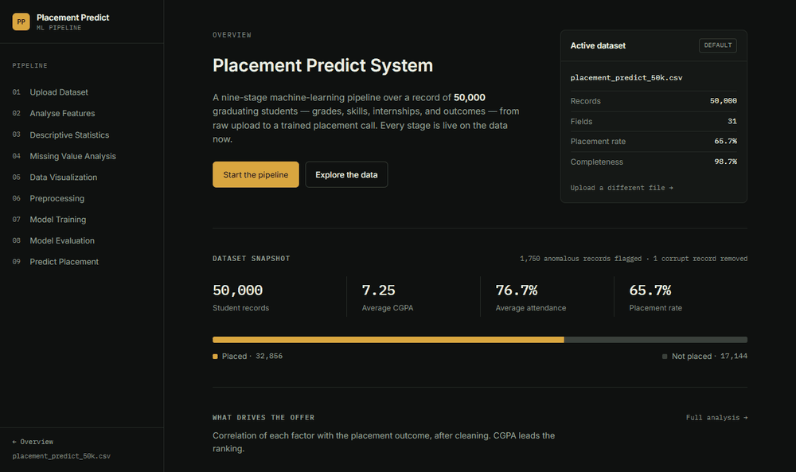
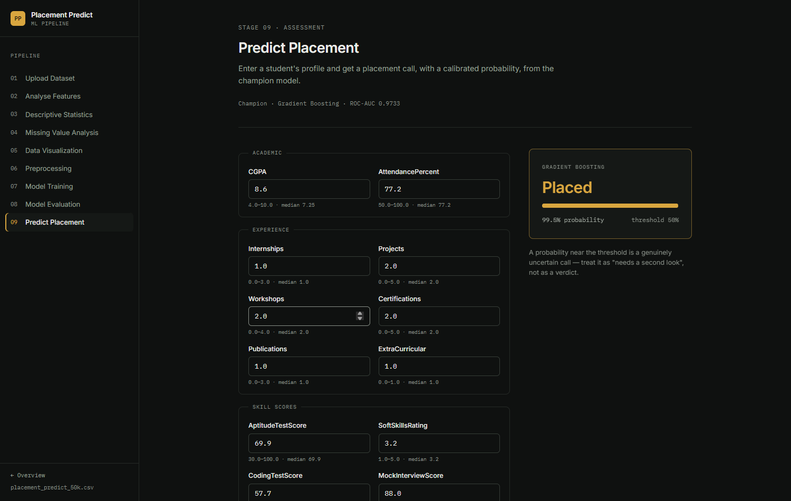

<div align="center">

# Placement Predict System

**An end-to-end ML pipeline that predicts engineering-student placements —
from raw CSV to a deployed prediction service, in one nine-stage web app.**

[](https://github.com/rushmanthnalluri/placement-predict/actions/workflows/ci.yml)
[](LICENSE)
[](https://www.python.org)

[🚀 **Live app**](https://placement-predict-p2z1.onrender.com) ·
[📊 **Static showcase**](https://rushmanthnalluri.github.io/placement-predict/) ·
[📋 **Model card**](MODEL_CARD.md) ·
[🔍 **Forensic audit**](docs/audit/FINAL_AUDIT.md)



</div>

## Quick start

```bash
pip install -r requirements.txt
python flask_project/app.py        # → http://127.0.0.1:5000
```

or one container, any host:

```bash
docker build -t placement-predict . && docker run -p 7860:7860 placement-predict
```

## What it does

Every stage of the ML lifecycle is a live page, computed from the real
dataset on every load — nothing is hardcoded. The home page opens with a
**dataset overview**: eight stat cards, placement-distribution donut,
toggleable feature-distribution and placement-rate charts, a core
correlation heatmap, and auto-generated data insights.

| # | Stage | What it shows |
|---|-------|---------------|
| 01 | Upload Dataset | Drag-and-drop CSV/Excel intake with instant profiling |
| 02 | Analyse Features | Full 31-field registry: types, roles, coverage, samples |
| 03 | Descriptive Statistics | Centre/spread/range for 20 numeric fields, split by outcome |
| 04 | Missing Value Analysis | 19,976 missing cells across 5 columns, mean-imputed |
| 05 | Data Visualization | Distributions, z-scores, 21×21 correlation heatmap, boxplots |
| 06 | Preprocessing | Stratified 80/20 split (seed 42), frozen train-only transforms |
| 07 | Model Training | Three candidates on one sealed split — drill into any model, benchmark any subset |
| 08 | Model Evaluation | Sealed-test metrics, ROC curves, confusion matrix, importances |
| 09 | Predict Placement | Validated profile form + model picker (or the recommended best) → call + calibrated probability |

## How it fits together

```
CSV upload ──► EDA bundle (cached) ──► split 80/20 (sealed test)
                                              │
              build time: train 3 models ──► champion by 3-fold CV
                                              │
              validated artifacts (sha256 + recipe version): bundle +
              champion at boot, one compressed file per candidate
                                              │
              ┌───────────────────────────────┼────────────────────┐
              ▼                               ▼                    ▼
        Flask web app                   JSON API              Static showcase
        (9 live stages)           /api/predict · /api/health   (GitHub Pages)
                                  /api/benchmark · /api/dataset
```

Runtime never trains on request for the bundled dataset — the artifact loads
in ~50 ms; a non-champion model selection lazy-loads its own artifact in ~1 s;
uploads retrain once (~9 s) and are cached.

## Results (sealed test set, assessed once)

| Model | Accuracy | Precision | Recall | F1 | ROC-AUC | Brier ↓ |
|-------|----------|-----------|--------|----|---------|---------|
| Logistic Regression | 0.892 | 0.902 | 0.938 | 0.920 | 0.960 | 0.074 |
| Random Forest | 0.908 | 0.915 | 0.949 | 0.931 | 0.972 | 0.066 |
| **Gradient Boosting (champion)** | **0.909** | **0.916** | **0.948** | **0.932** | **0.973** | **0.062** |

Top drivers: CGPA (0.65), Mock Interview Score (0.63), Soft Skills Rating (0.60).
Champion selection: 3-fold CV ROC-AUC on a 12k stratified training subsample.
Served probabilities are Platt-calibrated (3-fold out-of-fold on the training
split) — ROC-AUC unchanged by construction, Brier/log-loss improved. The v1
pre-calibration numbers were reproduced byte-identically by the independent
[forensic audit](docs/audit/FINAL_AUDIT.md).


## JSON API

```bash
curl https://placement-predict-p2z1.onrender.com/api/health
# → {"status":"ok","model":"Gradient Boosting","roc_auc":0.9733, ...}

# predict with the recommended best model (the default)…
curl -X POST https://placement-predict-p2z1.onrender.com/api/predict \
  -H "Content-Type: application/json" \
  -d '{"CGPA": 8.6, "MockInterviewScore": 88, "CodingTestScore": 85}'
# → {"placed": true, "probability": 99.9, "threshold": 0.5,
#    "model": "Gradient Boosting", "model_key": "gradient_boosting",
#    "roc_auc": 0.9733, ...}

# …or pick the model yourself: "model" accepts a registry key
# ("logistic_regression" | "random_forest" | "gradient_boosting"),
# a display name ("Random Forest"), or "best"
curl -X POST https://placement-predict-p2z1.onrender.com/api/predict \
  -H "Content-Type: application/json" \
  -d '{"model": "random_forest", "CGPA": 8.6, "CodingTestScore": 85}'

# dataset overview: summary stats, auto-generated insights, chart payloads
curl https://placement-predict-p2z1.onrender.com/api/dataset
# → {"summary": {"total_records": 50000, "placed": 32856, ...},
#    "insights": [...], "distributions": {...}, "rate_by_feature": {...},
#    "correlation": {...}}

# benchmark any subset of candidates on the active dataset
curl -X POST https://placement-predict-p2z1.onrender.com/api/benchmark \
  -H "Content-Type: application/json" \
  -d '{"models": ["logistic_regression", "random_forest", "gradient_boosting"]}'
# → per-model accuracy/precision/recall/F1/ROC-AUC, Brier & log-loss, CV
#   scores, train times, confusion matrices, and the best model (by CV
#   ROC-AUC) — every number from the real training run; an empty body
#   benchmarks all three; "fresh": true re-executes the pipeline for the
#   selection instead of reading the cached evaluation
```

All 12 fields optional (absent = dataset median). Probabilities are
Platt-calibrated. Errors are JSON: `400` with per-field details, `415` for
non-JSON, `503` when no model can train. The API sends
`Access-Control-Allow-Origin: *` (no credentials ever flow cross-origin), so
it is callable from any web page — the static showcase uses it for
server-side predictions with the selected model.

## Engineering practices worth pointing at

- **Leakage found in the wild** — the dataset ships a corrupt sentinel row
  (StudentID 0, holding per-column missing counts as values): detected,
  dropped, disclosed in the UI.
- **Honest evaluation** — the test set is sealed before any transform is fit
  and touched exactly once; all preprocessing statistics are train-only.
- **Graceful failure** — off-schema uploads, single-class datasets, and tiny
  files each get a clear explanation, never a crash or a traceback.
- **Secure by construction** — ephemeral session keys, path containment,
  schema-validated uploads, security headers, non-root container, strict
  pip-audit in CI.
- **Accessible & responsive** — keyboard-navigable, AA contrast,
  reduced-motion support, phone-to-desktop layouts.




## Testing & CI

78 pytest tests cover every route × dataset state, the API contract, model
artifacts, model selection, benchmarking, calibration, and degenerate-input
guards:

```bash
pytest -q                 # full suite (~30s)
pytest -m "not slow" -q   # fast subset (~3s)
```

Every push runs **pytest + Docker build + pip-audit** on GitHub Actions.

## Deploy it

**This app lives on Render:** https://placement-predict-p2z1.onrender.com
(free tier sleeps when idle — first hit after a lull takes ~30–60 s to wake).

- **Render**: New → Blueprint → this repo (`render.yaml` included).
- **Railway / Fly.io / any container host**: portable Dockerfile; expose `$PORT`.
- **Hugging Face Spaces**: Docker SDK works, but HF now requires PRO for Docker runtimes.
- **GitHub Pages**: `python flask_project/export_pages.py` re-renders `docs/`.
  The static demo calls the live API with the selected model, and falls back
  to an in-browser calibrated logistic baseline when the host is asleep.

## Project structure

```
flask_project/
├── app.py              # routes, JSON API, error handlers, security
├── eda.py              # cached dataset → EDA artifact computation
├── model.py            # split, CV selection, train, evaluate, infer, artifacts
├── train_artifact.py   # build-time pretraining for zero-cost cold starts
├── export_pages.py     # renders the static GitHub Pages snapshot
├── data/               # bundled 50k dataset
├── static/             # design system CSS, Chart.js builders
└── templates/          # Jinja templates, one per stage
tests/                  # 78-test pytest suite
docs/                   # Pages site + audit trail (docs/audit/)
MODEL_CARD.md           # intended use, methodology, limitations
Dockerfile · render.yaml · requirements.txt
eda.ipynb               # original exploratory notebook
```

## Data

Synthetic 50,000-record dataset modelled on Indian engineering-college
placement data: 8 semester SGPAs, CGPA, attendance, experience counts,
four skill scores, and the placement outcome. The corrupt sentinel row
(StudentID 0) is dropped; the 1,750 `IsAnomaly` records are *retained* —
their placement rate matches the population (65.7%), so they act as
label-consistent noise. A deliberate, disclosed choice.

## Roadmap

- Cost-based threshold control
- Per-prediction explanations (SHAP-style "why this call")
- Fairness slices: performance by Gender/CollegeTier with group metrics

## License

MIT — see [LICENSE](LICENSE).

---

Built as the capstone of a 12-week classical-ML self-learning track (25SC2107E,
KL Deemed to be University): EDA → preprocessing → linear baseline → tree
ensembles → honest evaluation → deployment.
