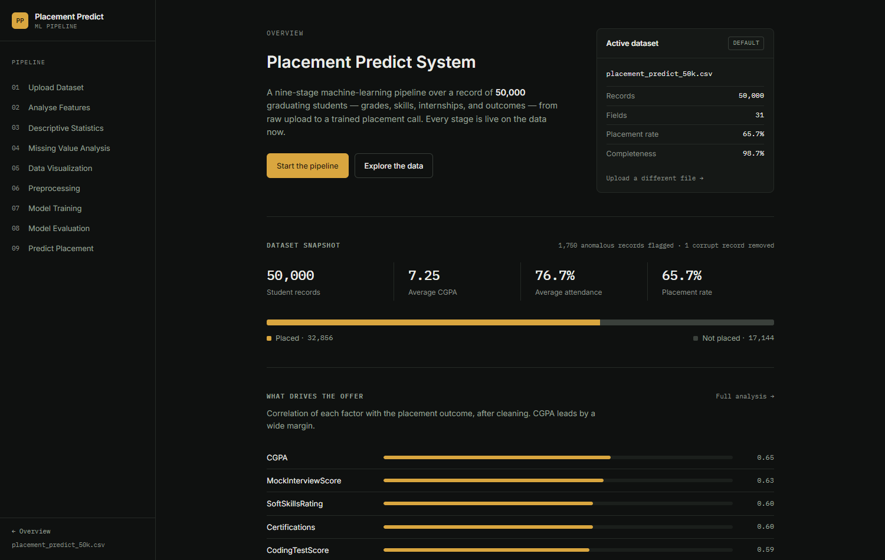
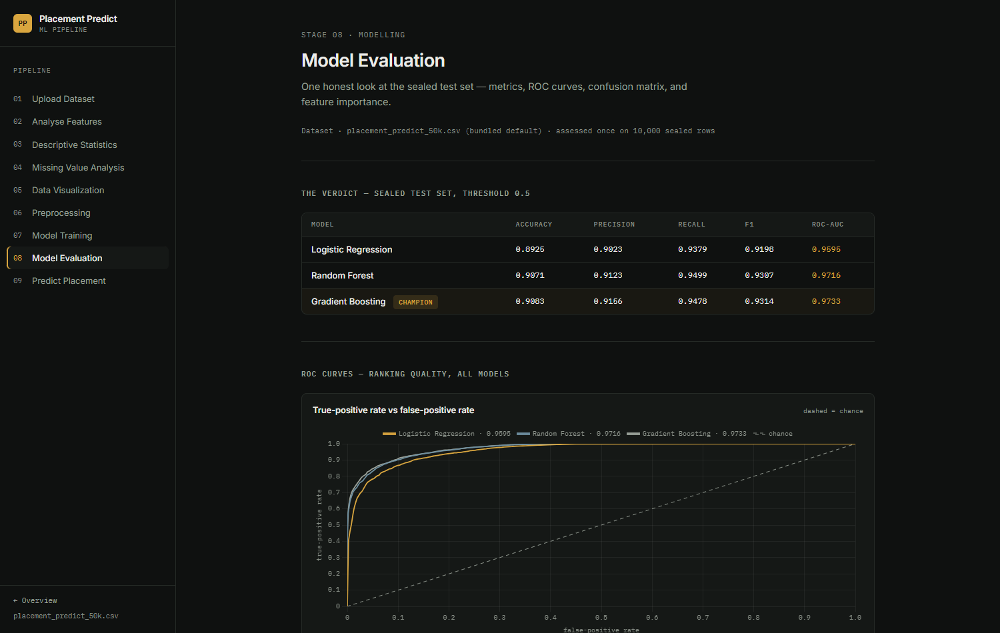
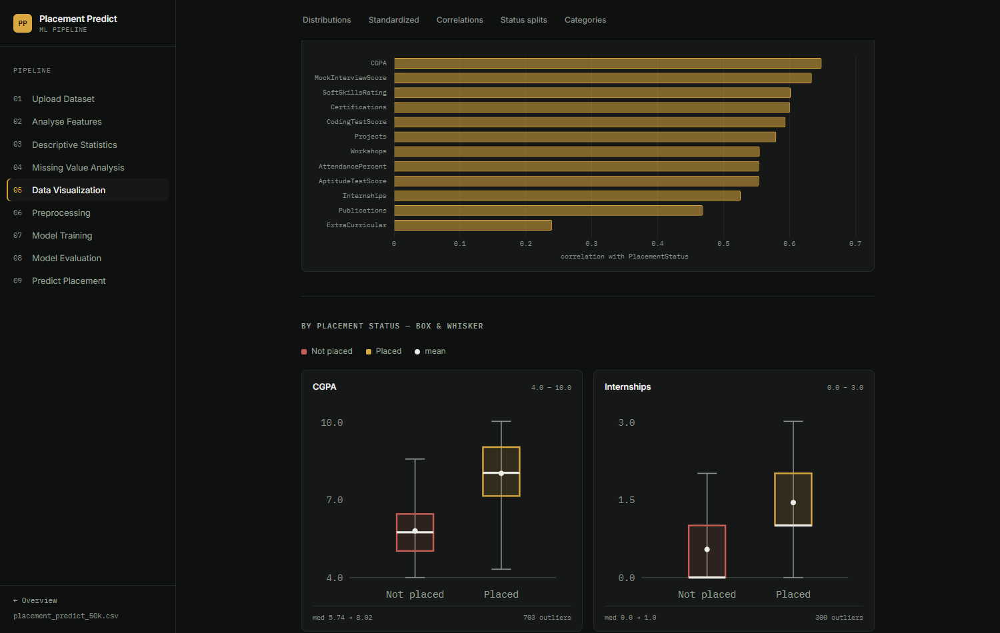

# Placement Predict System

An end-to-end machine-learning pipeline that predicts whether an engineering
student will be placed — from raw data upload to a deployed prediction form —
built as a nine-stage web application over a 50,000-record dataset.

**Live demo (static showcase):** https://rushmanthnalluri.github.io/placement-predict/



## What it does

Every stage of the ML lifecycle is a live page in the app, computed from the
real dataset on every load — nothing is hardcoded:

| # | Stage | What it shows |
|---|-------|---------------|
| 01 | Upload Dataset | Drag-and-drop CSV/Excel intake with instant profile (rows, columns, missing cells, preview) |
| 02 | Analyse Features | Full 31-field registry: types, roles, coverage, sample values |
| 03 | Descriptive Statistics | Centre/spread/range for 20 numeric fields, then split by outcome |
| 04 | Missing Value Analysis | 19,976 missing cells across 5 columns, repaired by mean imputation |
| 05 | Data Visualization | Distributions, z-scored scores, 21×21 correlation heatmap, boxplots by outcome, category rates |
| 06 | Preprocessing | Stratified 80/20 split (seed 42) with frozen train-only transforms |
| 07 | Model Training | Logistic regression, random forest, gradient boosting — trained and timed |
| 08 | Model Evaluation | Sealed-test metrics, ROC curves, confusion matrix, feature importance |
| 09 | Predict Placement | Validated profile form returning the champion's call + probability |

## Results (sealed test set, assessed once)

| Model | Accuracy | Precision | Recall | F1 | ROC-AUC |
|-------|----------|-----------|--------|----|---------|
| Logistic Regression | 0.893 | 0.902 | 0.938 | 0.920 | 0.960 |
| Random Forest | 0.907 | 0.912 | 0.950 | 0.931 | 0.972 |
| **Gradient Boosting (champion)** | **0.908** | **0.916** | **0.948** | **0.931** | **0.973** |

Top drivers: CGPA (0.65), Mock Interview Score (0.63), Soft Skills Rating (0.60).



## Engineering practices worth pointing at

- **Leakage found in the wild**: the dataset ships a corrupt sentinel row
  (StudentID 0, holding per-column missing counts as values) — detected,
  dropped, and disclosed in the UI.
- **Honest evaluation**: the test set is sealed before any transform is fit
  and touched exactly once; preprocessing statistics come from training rows
  only.
- **Graceful failure**: off-schema uploads, single-class datasets, and tiny
  files each get a clear explanation instead of a crash.
- **Performance**: a 6.5 MB dataset is parsed once, cached, and every chart is
  computed from cached aggregates; models retrain in ~2 s on dataset change.
- **Accessibility & responsive**: keyboard-navigable throughout, AA contrast,
  reduced-motion support, works from phone to desktop.




## Tech stack

Python · Flask · pandas · scikit-learn · Chart.js — no JavaScript framework,
no build step. Tests of every route × dataset state are run with Playwright.

## Run it locally

```bash
pip install -r requirements.txt
python flask_project/app.py        # http://127.0.0.1:5000
```

## Deploy it (one Dockerfile, any host)

```bash
docker build -t placement-predict .
docker run -p 7860:7860 placement-predict
```

- **Render**: New → Blueprint → this repo (`render.yaml` is included).
- **Hugging Face Spaces**: create a Space with the **Docker** SDK and add this
  header to the Space's README:
  ```yaml
  ---
  title: Placement Predict
  sdk: docker
  ---
  ```
- **GitHub Pages** (static showcase): `python flask_project/export_pages.py`
  re-renders `docs/` from the live app; push to update the demo.

## Project structure

```
flask_project/
├── app.py            # routes, pipeline registry, error handlers
├── eda.py            # cached dataset → EDA artifact computation
├── model.py          # split, train, evaluate, infer (cached per dataset)
├── export_pages.py   # renders the static GitHub Pages snapshot
├── data/             # bundled 50k dataset (CSV twin of the Excel original)
├── static/           # design system CSS, Chart.js builders
└── templates/        # Jinja templates, one per stage
docs/                 # static showcase served by GitHub Pages
eda.ipynb             # original exploratory notebook
```

## Data

Synthetic 50,000-record dataset modelled on Indian engineering-college
placement data: 8 semester SGPAs, CGPA, attendance, experience counts
(internships, projects, workshops, certifications, publications), four skill
scores, and the placement outcome. One corrupt sentinel row and 1,750 flagged
anomalous records are handled explicitly.

---

Built as the capstone of a 12-week classical-ML self-learning track (25SC2107E,
KL Deemed to be University): EDA → preprocessing → linear baseline → tree
ensembles → honest evaluation → deployment.
