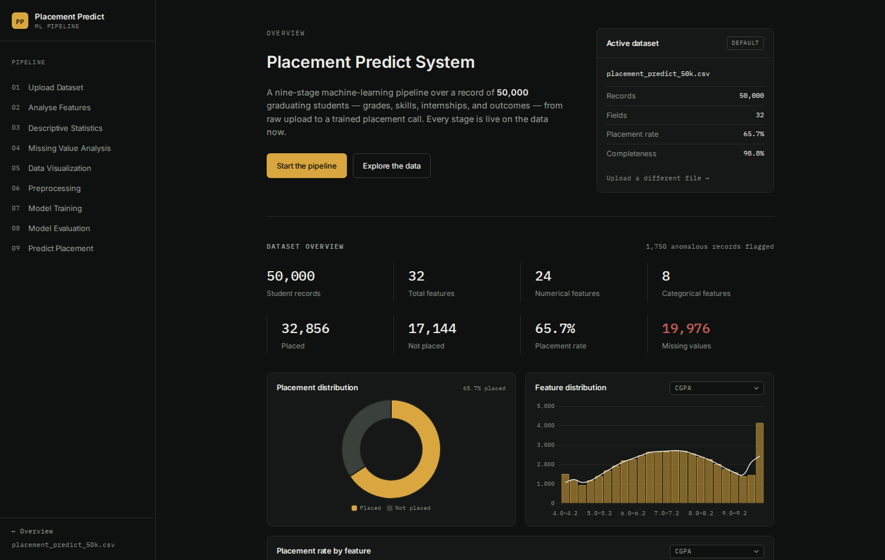
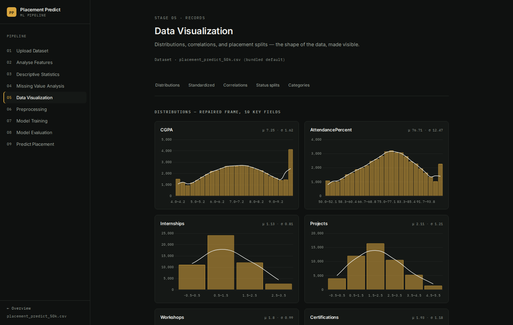
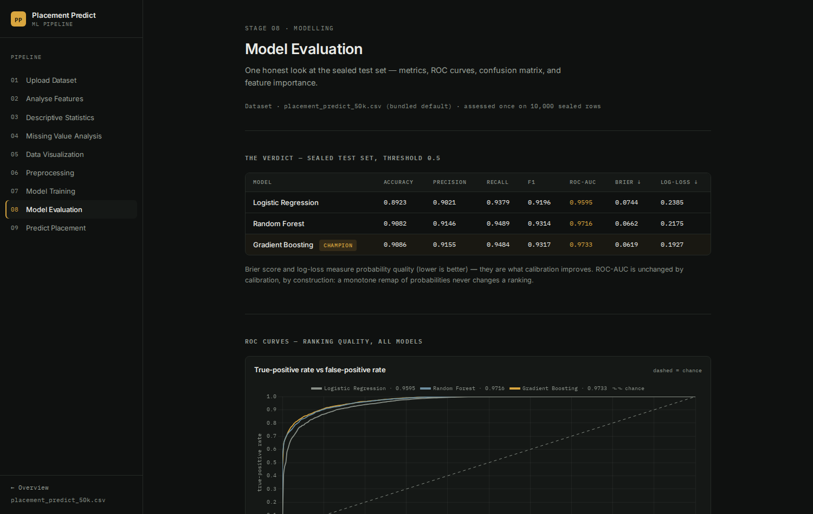
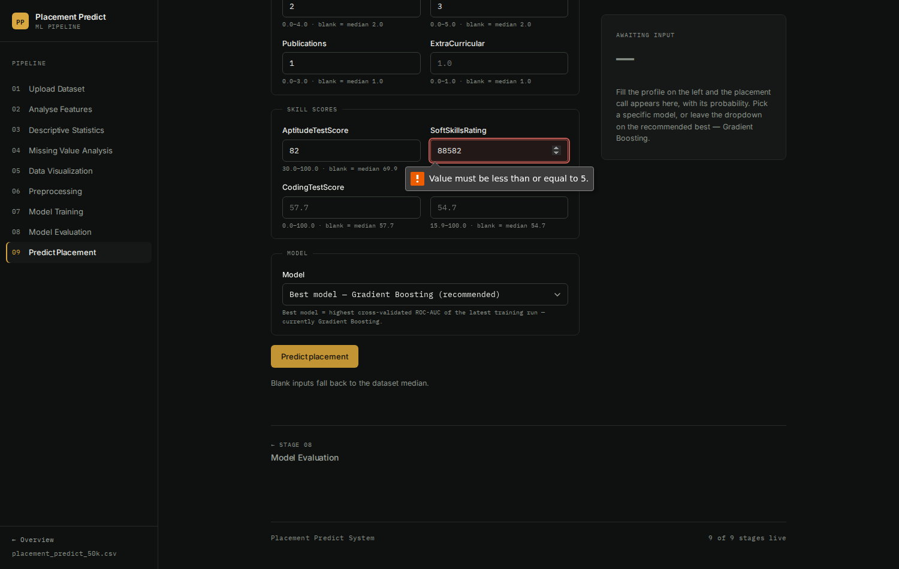

<div align="center">

# Placement Predict System

**An end-to-end ML pipeline that predicts engineering-student placements — from raw CSV to a deployed prediction service, in one nine-stage web app.**

[](https://github.com/rushmanthnalluri/placement-predict/actions/workflows/ci.yml)
[](LICENSE)
[](https://www.python.org)

[🚀 **Live app**](https://placement-predict-p2z1.onrender.com) ·
[📊 **Static showcase**](https://rushmanthnalluri.github.io/placement-predict/) ·
[💼 **LinkedIn**](https://www.linkedin.com/in/rushmanthnalluri/) ·
[📋 **Model card**](MODEL_CARD.md) ·
[🔍 **Forensic audit**](docs/audit/FINAL_AUDIT.md)


</div>

## Project Overview

Placement outcomes depend on many factors at once — academic record, experience, technical and soft-skill scores. Placement Predict treats that as a dataset-driven machine-learning problem: it ingests a 50,000-record dataset of Indian engineering students, runs a full exploratory analysis, benchmarks three classification models against each other under a sealed-test protocol, and serves individual predictions with calibrated probabilities from a deployed Flask web app.

Every page in the app is computed live from the real dataset — no number is hardcoded. The project exists as a GitHub portfolio piece, a faculty demo, and the capstone of a 12-week classical-ML self-learning track; it is built to be read, run, and audited.

## Live Demo

- **Live app:** https://placement-predict-p2z1.onrender.com
- **Static showcase:** https://rushmanthnalluri.github.io/placement-predict/

> The app runs on Render's free tier, which sleeps when idle — the first hit after a lull takes ~30–60 s to wake. Subsequent requests are instant.

## Features

### Dataset overview & EDA

- A home page plus nine pipeline stages, each a live page: `/` (home), `/upload`, `/features`, `/descriptive`, `/missing`, `/visualize`, `/preprocess`, `/train`, `/evaluate`, `/predict` — with a sidebar stepper driven by `PIPELINE_STEPS`.
- Full 32-field registry with types, roles, coverage, and samples (24 numeric / 8 categorical fields in 6 groups).
- Descriptive statistics (centre, spread, range) for 21 numeric fields, plus a by-outcome comparison of the 12 core factors.
- Missing-value analysis: 19,976 missing cells across exactly 5 columns, mean-imputed.
- Drag-and-drop `.csv`/`.xlsx` upload (≤10 MB), schema-validated against 13 required columns, per-session namespaced storage, instant profiling preview of the first 8 rows.

### Model training & benchmarking

- Three candidates trained on one sealed 80/20 stratified split (seed 42).
- Champion selected by 3-fold cross-validation ROC-AUC on a 12,000-row stratified training subsample — test metrics are reported, never used for selection.
- Platt-calibrated probabilities via `CalibratedClassifierCV` (3-fold out-of-fold, training split only).
- In-app benchmarking of any model subset, from the cached evaluation or a fresh re-run.

### Placement prediction

- Validated 12-input profile form with a model picker (recommended best, or any candidate).
- Placed / Not placed verdict with a calibrated probability bar at a 50% threshold.
- Expected salary package alongside the verdict — a Gradient Boosting regressor trained on placed students only (same sealed split; MAE 0.67 LPA, R² 0.9593), shown as the conditional package if placed and the probability-weighted expectation.
- Also available as a JSON endpoint for programmatic use.

### Visualization

- Placement donut, toggleable feature-distribution and placement-rate-by-feature charts, correlation heatmaps, SVG boxplots split by outcome, categorical placement-rate charts.
- Chart.js 4.4.3 renders the charts; heatmaps, the confusion matrix, and boxplots are hand-rendered HTML/SVG.

### JSON API

- `GET /api/health` · `GET /api/dataset` · `POST /api/predict` · `POST /api/benchmark`.
- Shares the same validation rules and model-selection code as the UI; CORS-enabled for any origin.

### Engineering highlights

- **Leakage found in the wild** — an earlier dataset revision shipped a corrupt sentinel row (StudentID 0, holding per-column missing counts as values); the detect-and-drop guard remains in the pipeline and now protects user uploads.
- **Honest evaluation** — the test set is sealed before any transform is fit and touched exactly once; all preprocessing statistics are train-only.
- **Graceful failure** — off-schema uploads, single-class datasets, and tiny files each get a clear explanation, never a traceback. Branded 404/413/500 pages.
- **Secure by construction** — ephemeral session keys, path containment on uploads, schema-validated uploads, security headers (`X-Content-Type-Options: nosniff`, `X-Frame-Options: DENY`, `Referrer-Policy: strict-origin-when-cross-origin`), non-root container, strict pip-audit in CI.
- **Accessible & responsive** — keyboard-navigable, AA contrast, reduced-motion support, phone-to-desktop layouts, server-rendered pages that work with JavaScript disabled.

## ML Models

### Logistic Regression

An interpretable linear baseline: the model learns one weight per feature, so each coefficient reads directly as that feature's contribution to the log-odds of placement. Here it runs with `max_iter=2000` and the `lbfgs` solver, and it is the only model fed z-scored (standardized) inputs — linear models need comparable scales, trees do not.

### Random Forest

A bagging ensemble of 150 decision trees, each trained on a bootstrapped sample with random feature subsets, voting together. It models nonlinear interactions (e.g. CGPA mattering differently at different aptitude levels) that a linear model cannot.

### Gradient Boosting

A sequential boosting ensemble of shallow trees, where each new tree is fit to the residual errors of the ensemble so far. This is scikit-learn's histogram-based `HistGradientBoostingClassifier`, and it is the champion of this project — the strongest on cross-validation and on the sealed test set.

### Salary regressor

A sibling `HistGradientBoostingRegressor` (same default depth · lr 0.1 · seed 42) predicts the offered package in LPA. It trains only on the placed rows of the same sealed 80/20 split — 26,285 training / 6,571 test rows — because salary is an outcome of placement, so not-placed rows (0 LPA) never enter its training data and the column is never a classifier input. On the sealed test rows it posts MAE 0.67 LPA and R² 0.9593. The app reports it two ways: the conditional package if placed, and the placement-probability-weighted expectation.

### Model registry

| Key | Display name | Estimator | Settings |
|-----|--------------|-----------|----------|
| `logistic_regression` | Logistic Regression | `LogisticRegression` | max_iter 2000 · lbfgs · z-scored inputs |
| `random_forest` | Random Forest | `RandomForestClassifier` | 150 trees · n_jobs 2 · seed 42 |
| `gradient_boosting` | Gradient Boosting | `HistGradientBoostingClassifier` | default depth · learning rate 0.1 · seed 42 |

## Dataset

`flask_project/data/placement_predict_50k.csv` — a synthetic dataset modelled on Indian engineering-college placement data.

| Stat | Value |
|------|-------|
| Raw shape | 50,000 rows × 32 columns |
| Analysed records | 50,000 (shipped clean — no sentinel row) |
| Placed | 32,856 (65.7%) |
| Not placed | 17,144 (34.3%) |
| Field types | 24 numeric · 8 categorical |
| Missing cells | 19,976 of 1,600,000 (98.8% complete) |
| Anomaly rows | 1,750 (3.5%), retained deliberately |
| CGPA quartiles | 25%: 6.04 · median: 7.25 · 75%: 8.48 |
| Averages | attendance 76.7 · aptitude 68.9 |

The 32 fields fall into six groups:

- **Identity** — StudentID
- **Demographics** — Gender (M 30,133 / F 19,867), City (10 cities), CollegeTier (Tier1/2/3), Stream (6), Specialisation (4), Hostel (Y/N)
- **Academic** — SGPA_Sem1–SGPA_Sem8, CGPA, AttendancePercent, HistoryOfBacklogs (Y/N), CGPA_Tier (Low/Mid/High)
- **Experience** — Internships, Projects, Workshops, Certifications, Publications, ExtraCurricular (binary 0/1)
- **Skill scores** — AptitudeTestScore, SoftSkillsRating, CodingTestScore, MockInterviewScore
- **Outcome** — PlacementStatus (target, 0/1), IsAnomaly, Salary Package (LPA, 0 = not placed — an outcome column: never a classifier input, only the salary regressor's target)

**Missing values** — exactly 5 columns carry missing data, 19,976 cells in total:

| Column | Missing | Share |
|--------|---------|-------|
| MockInterviewScore | 4,957 | 9.9% |
| Workshops | 4,488 | 9.0% |
| AptitudeTestScore | 4,029 | 8.1% |
| SoftSkillsRating | 3,526 | 7.1% |
| CodingTestScore | 2,976 | 6.0% |

EDA pages show full-dataset mean imputation; the model imputes all 12 features with training-split means only.

**Sentinel-row guard.** Earlier revisions of the raw file carried one corrupt sentinel row (StudentID 0) holding per-column missing counts as values — impossible on every scale. The current revision ships clean; the detect-and-drop guard remains in the pipeline and still applies to user uploads.

**Anomaly disclosure.** The 1,750 `IsAnomaly` records (3.5%) are *retained* deliberately: their placement rate (65.71%) matches the population, so they act as label-consistent noise rather than leakage. A deliberate, disclosed choice.

## ML Pipeline


```mermaid
---
config:
  htmlLabels: false
---
flowchart LR
    A["50k placement dataset"] --> B["Clean — sentinel-row guard (uploads)"]
    B --> C["Stratified 80/20 split · seed 42"]
    C --> D["Fit on train only: mean imputation · scaler"]
    D --> E["Train 3 candidates + Platt calibration"]
    E --> F["Champion by 3-fold CV ROC-AUC on 12k training rows"]
    F --> G["Sealed test evaluation — touched exactly once"]
    G --> H["Serve: web app · JSON API · sha256-validated artifacts"]
```

| # | Stage | What it shows |
|---|-------|---------------|
| 01 | Upload Dataset | Drag-and-drop CSV/Excel intake with instant profiling |
| 02 | Analyse Features | Full 32-field registry: types, roles, coverage, samples (24 numeric / 8 categorical, 6 groups) |
| 03 | Descriptive Statistics | Centre/spread/range for 21 numeric fields + by-outcome split of the 12 core factors |
| 04 | Missing Value Analysis | 19,976 missing cells across 5 columns, mean-imputed |
| 05 | Data Visualization | Distributions, z-scores, 22×22 correlation heatmap, boxplots, category rates |
| 06 | Preprocessing | Stratified 80/20 split (seed 42), frozen train-only transforms |
| 07 | Model Training | Three candidates on one sealed split — drill into any model, benchmark any subset |
| 08 | Model Evaluation | Sealed-test metrics, ROC + reliability curves, confusion matrix, importances |
| 09 | Predict Placement | Validated profile form + model picker (or the recommended best) → call + calibrated probability |

## Model Benchmarking

The `/train` page benchmarks models live, and `POST /api/benchmark` exposes the same machinery: benchmark any subset of the three candidates, served from the cached evaluation by default, or with `"fresh": true` to genuinely re-run the pipeline for that selection.

The selection rule is the highest mean ROC-AUC from 3-fold stratified cross-validation (shuffle, seed 42) on a 12,000-row stratified subsample of the training split. Metrics computed per model:

- Accuracy, precision, recall, F1
- ROC-AUC
- Brier score and log-loss (probability quality)
- CV ROC-AUC mean ± std
- Train time (reported per run — hardware-dependent)
- Confusion matrix

Every number comes from the real training run — nothing is hardcoded.

## Dataset Visualization

**Home page (`/`)** — eight stat cards, a placement-distribution donut, toggleable feature-distribution and placement-rate-by-feature charts, a 13×13 core correlation heatmap, auto-generated data insights, and the top-5 placement drivers.

**`/visualize` page** — ten distribution histograms with smoothing, four z-score histograms, the full 22×22 correlation heatmap, an influence-on-outcome bar chart, nine SVG boxplots split by outcome, six categorical placement-rate charts, and a gender × outcome chart.

Chart.js 4.4.3 (jsDelivr CDN) renders the interactive charts; heatmaps, the confusion matrix, and boxplots are hand-rendered HTML/SVG — they work with JavaScript disabled.

## Placement Prediction

The `/predict` page takes a student profile and returns a placement call:

- **Inputs** — 12 numeric fields grouped Academic / Experience / Skill scores, validated against observed dataset min/max. Leaving a field blank uses the dataset median.
- **Model picker** — "Best model" recommended, plus each candidate labelled with its sealed-test ROC-AUC.
- **Result** — a Placed / Not placed verdict, a calibrated probability bar at the 50% threshold, the model used, its ROC-AUC, and a "Best model" badge when the champion made the call. Alongside: the expected salary package — conditional if placed (`salary_package_lpa`) and probability-weighted (`expected_package_lpa`) — from a regressor trained on placed students only; salary itself is never a classifier input.
- **Responsible note** — the output is a calibrated statistical estimate, not a guarantee of any real outcome.

## System Architecture

```
Browser ──► Flask app (Jinja SSR — 9 live pipeline stages)
  │             │
  │             ├── eda.py    cached EDA bundle (in-memory LRU, path+mtime keyed)
  │             └── model.py  sha256-validated joblib artifact, or train once + cache
  │
  └──► JSON API — /api/health · /api/dataset · /api/predict · /api/benchmark
GitHub Pages static showcase ──► live API (9 s timeout)
                          └──► in-browser calibrated logistic fallback when the host sleeps
```

The app is a server-rendered Flask application. `eda.py` computes the EDA bundle once per dataset and caches it in an in-memory LRU keyed by path + mtime + size. `model.py` loads a sha256- and recipe-version-validated joblib artifact, or trains once and caches the result. The JSON API applies the same validation rules and model-selection code as the UI. The GitHub Pages static showcase calls the live API with a 9-second timeout and falls back to an in-browser Platt-calibrated logistic-regression baseline when the host sleeps.

## Project Structure

```
placement-predict/
├── flask_project/
│   ├── app.py              # routes, JSON API, error handlers, security
│   ├── eda.py              # cached dataset → EDA bundle computation
│   ├── model.py            # split, CV selection, train, calibrate, evaluate, infer, artifacts
│   ├── train_artifact.py   # build-time pretraining for zero-cost cold starts
│   ├── export_pages.py     # renders the static GitHub Pages snapshot into docs/
│   ├── placement_predict_50k Dataset.xlsx  # original Excel dataset
│   ├── data/               # bundled 50k CSV (+ gitignored trained artifacts & uploads)
│   ├── static/             # design-system CSS, Chart.js builders, site JS
│   └── templates/          # Jinja templates, one per stage
├── tests/                  # 84-test pytest suite (7 files)
├── docs/                   # GitHub Pages site + forensic audit trail (docs/audit/)
├── screenshots/            # demo.gif + page captures used in this README
├── .github/workflows/      # ci.yml — pytest + Docker build + pip-audit
├── placement_predict_50k Dataset.csv   # cleaned 50k copy at repo root (no sentinel row)
├── eda.ipynb               # original exploratory notebook
├── MODEL_CARD.md           # intended use, methodology, limitations
├── Dockerfile · render.yaml · requirements.txt
└── LICENSE                 # MIT
```

## Tech Stack

| Layer | Technology |
|-------|------------|
| Language | Python 3.12 (CI and deployment baseline) |
| Backend | Flask 3 (Jinja2, Werkzeug), gunicorn |
| Machine learning | scikit-learn 1.9.0 — HistGradientBoostingClassifier · RandomForestClassifier · LogisticRegression · CalibratedClassifierCV; joblib artifacts |
| Data processing | pandas ≥2.0, NumPy, openpyxl (Excel intake) |
| Frontend | Server-rendered Jinja2, vanilla JS, Chart.js 4.4.3 (jsDelivr CDN), custom CSS design system (Inter + IBM Plex Mono) |
| Testing & QA | pytest (84 tests), pip-audit |
| CI | GitHub Actions (pytest · Docker build · pip-audit) |
| Deployment | Render (Blueprint) · Docker · GitHub Pages |
| Version control | Git + GitHub |

## Installation

Requires **Python 3.12** for the reproducible release baseline. A virtual environment is recommended:

```bash
git clone https://github.com/rushmanthnalluri/placement-predict.git
cd placement-predict
python -m venv .venv && source .venv/bin/activate   # Windows: .venv\Scripts\activate
pip install -r requirements.txt
```

Dependencies: `flask>=3.1.3`, `jinja2>=3.1.6`, `werkzeug>=3.1.8`, `numpy>=1.26`, `pandas>=2.0`, `joblib>=1.2`, `scikit-learn==1.9.0`, `openpyxl>=3.1`, `gunicorn>=21.2`.

## Environment Variables

**None are required** — there is no `.env` file in the repo and none is needed. All supported variables are optional:

| Variable | Purpose | Default |
|----------|---------|---------|
| `SECRET_KEY` | Signs the Flask session cookie | unset → ephemeral random key at startup (sessions don't survive restarts); Render generates one |
| `SESSION_COOKIE_SECURE` | Set `1` to mark the session cookie Secure (HTTPS) | off so local http works |
| `WARM_MODEL` | Set `1` to train models in a background thread at boot | off (boot-time training can OOM memory-capped hosts) |
| `FLASK_DEBUG` | Set `1` for Flask debug mode | off |
| `PORT` | Injected by Render/container hosts; gunicorn binds to it | Docker image defaults to 7860 |

## Running Locally

**Development:**

```bash
python flask_project/app.py   # → http://127.0.0.1:5000
```

Set `FLASK_DEBUG=1` to opt into Flask debug mode. On a fresh clone without prebuilt artifacts, the first model-stage visit trains all three models with calibration (about 10 s on the audited environment), then caches in memory; EDA pages are instant. Production Docker/Render builds pretrain the artifacts.

**Production:**

```bash
gunicorn --bind 0.0.0.0:$PORT --workers 1 --threads 4 --timeout 120 --chdir flask_project app:app
```

**Docker:**

```bash
docker build -t placement-predict . && docker run -p 7860:7860 placement-predict
# → http://localhost:7860
```

The image pretrains the model artifacts at build time, so cold starts cost nothing.

## API Documentation

Base URL: `https://placement-predict-p2z1.onrender.com` (or your local host).

| Method | Endpoint | Description |
|--------|----------|-------------|
| GET | `/api/health` | Service + model status; never triggers training |
| GET | `/api/dataset` | Dataset summary, auto-generated insights, chart payloads |
| POST | `/api/predict` | Placement prediction with calibrated probability |
| POST | `/api/benchmark` | Benchmark any subset of the three candidates |

```bash
# health: status, active dataset, champion model, sealed-test ROC-AUC
curl https://placement-predict-p2z1.onrender.com/api/health
# → {"status":"ok","dataset":"placement_predict_50k.csv",
#    "is_default_dataset":true,"trained":true,"artifact_available":true,
#    "model":"Gradient Boosting","roc_auc":0.9733}

# predict with the recommended best model (the default)…
curl -X POST https://placement-predict-p2z1.onrender.com/api/predict \
  -H "Content-Type: application/json" \
  -d '{"CGPA": 8.6, "MockInterviewScore": 88, "CodingTestScore": 85}'
# → {"placed": true, "probability": 99.9, "threshold": 0.5,
#    "model": "Gradient Boosting", "model_key": "gradient_boosting",
#    "roc_auc": 0.9733, "salary_package_lpa": 22.4,
#    "expected_package_lpa": 22.4, ...}

# …or pick the model yourself: "model" accepts a registry key
# ("logistic_regression" | "random_forest" | "gradient_boosting"),
# a display name ("Random Forest", any casing), or a best-alias
# ("best", "best_model", "recommended", "auto", "champion")
curl -X POST https://placement-predict-p2z1.onrender.com/api/predict \
  -H "Content-Type: application/json" \
  -d '{"model": "random_forest", "CGPA": 8.6, "CodingTestScore": 85}'

# dataset overview: summary stats, auto-generated insights, chart payloads
curl https://placement-predict-p2z1.onrender.com/api/dataset
# → {"summary": {"total_records": 50000, "total_features": 32,
#    "numerical_features": 24, "categorical_features": 8, "placed": 32856, ...},
#    "insights": [...], "distributions": {...}, "rate_by_feature": {...},
#    "correlation": {...}}   # 13×13 core matrix

# benchmark any subset of candidates on the active dataset
curl -X POST https://placement-predict-p2z1.onrender.com/api/benchmark \
  -H "Content-Type: application/json" \
  -d '{"models": ["logistic_regression", "random_forest", "gradient_boosting"]}'
# → per-model accuracy/precision/recall/F1/ROC-AUC, Brier & log-loss, CV
#   scores, train times, confusion matrices, best (of the requested
#   subset, by CV ROC-AUC) and overall_best; an empty/absent body
#   benchmarks all three from the cached evaluation; "fresh": true
#   (strict boolean — the string "false" does NOT retrain) re-executes
#   the pipeline for the selection
```

All 12 prediction fields are optional (absent = dataset median) and validated against observed min/max. Probabilities are Platt-calibrated.

**Error behavior** — API errors are JSON, never tracebacks:

- `400` — validation failed (with per-field details), unknown model (returns `valid_models`), or bad benchmark body (unknown/empty model list)
- `415` — request body is not JSON
- `503` — no trained model available, schema mismatch, or active dataset off-schema

A wrong HTTP method (`405`) or unknown URL (`404`) renders the branded HTML error page.

**CORS** — the API sends `Access-Control-Allow-Origin: *` on `/api/*` only, and credentials never flow cross-origin, so any web page can call it. The static showcase uses it for server-side predictions with the selected model.

## Deployment

### Render (this app's host)

The repo ships a `render.yaml` Blueprint: **New → Blueprint → this repo** is the whole deploy. Facts:

- `type: web`, `name: placement-predict`, `runtime: python`, `plan: free`
- `buildCommand`: `pip install -r requirements.txt && python flask_project/train_artifact.py` — artifacts are pretrained at build, so cold starts never train
- `startCommand`: `gunicorn --bind 0.0.0.0:$PORT --workers 1 --threads 4 --timeout 120 --chdir flask_project app:app`
- `SECRET_KEY` is set with `generateValue: true`

Free tier sleeps when idle — first hit after a lull takes ~30–60 s to wake.

### Docker

The Dockerfile is portable across container hosts: expose `$PORT` (defaults to 7860), artifacts pretrained at build, runs as a non-root user.

### Hugging Face Spaces

The Docker SDK works — the YAML front matter at the top of this README (`sdk: docker`) is the Space configuration. Check Hugging Face's current plan requirements for Docker runtimes before deploying.

### GitHub Pages

```bash
python flask_project/export_pages.py   # re-renders the static snapshot into docs/
```

The static site calls the live API for predictions and falls back to an in-browser calibrated logistic baseline when the host is asleep.

## Results

Sealed test set — 10,000 rows, threshold 0.5, assessed exactly once:

| Model | Accuracy | Precision | Recall | F1 | ROC-AUC | Brier ↓ | Log-loss ↓ |
|-------|----------|-----------|--------|----|---------|---------|------------|
| Logistic Regression | 0.8923 | 0.9021 | 0.9379 | 0.9196 | 0.9595 | 0.0744 | 0.2385 |
| Random Forest | 0.9082 | 0.9146 | 0.9489 | 0.9314 | 0.9716 | 0.0662 | 0.2175 |
| **Gradient Boosting (champion)** | **0.9086** | **0.9155** | 0.9484 | **0.9317** | **0.9733** | **0.0619** | **0.1927** |

Cross-validation (3-fold, 12,000-row stratified training subsample, ROC-AUC mean ± std):

| Model | CV ROC-AUC |
|-------|------------|
| Logistic Regression | 0.9638 ± 0.0022 |
| Random Forest | 0.9725 ± 0.0023 |
| **Gradient Boosting (champion)** | **0.9726 ± 0.0025** |

Champion confusion matrix (sealed test):

| | Predicted placed | Predicted not placed |
|---|---|---|
| **Actually placed** | TP 6,232 | FN 339 |
| **Actually not placed** | FP 575 | TN 2,854 |

Top drivers — Random-Forest importances (mean decrease in impurity, labelled as such in-app): CGPA 0.297, MockInterviewScore 0.165, CodingTestScore 0.132, AptitudeTestScore 0.085, SoftSkillsRating 0.084. Correlation drivers: CGPA 0.65, MockInterviewScore 0.63, SoftSkillsRating 0.60, Certifications 0.60, CodingTestScore 0.59.

**Why Gradient Boosting is champion.** By the selection rule it posts the highest CV ROC-AUC (0.9726), and on the sealed test set it is strictly best on ROC-AUC, Brier score, and log-loss — i.e. the best-calibrated probabilities — while also edging accuracy, precision, and F1. Random Forest edges recall by 0.0005 (0.9489 vs 0.9484), the one metric the champion does not lead.

**Evaluation honesty.** The test set was sealed before any transform was fit and touched exactly once; all preprocessing statistics are train-only. The v1 pre-calibration numbers were reproduced byte-identically by the independent [forensic audit](docs/audit/FINAL_AUDIT.md).

## Screenshots / Demo

The animated demo sits at the [top of this README](#placement-predict-system). Page captures:

**Dataset Overview**



**Data Visualization**



**Model Evaluation**



**Placement Prediction**



## Testing & CI

84 pytest tests (the `slow` marker is registered in `tests/conftest.py`):

```bash
pytest -q                 # full suite (trains + evaluates all models once)
pytest -m "not slow" -q   # fast subset — skips model training
```

Coverage: every route × dataset state, the API contract, model artifacts, model selection, benchmarking, calibration, degenerate-input guards, upload intake, CORS, and security headers.

CI (`.github/workflows/ci.yml`, on push/PR to `main`) runs pytest on Python 3.12, a Docker build, strict pip-audit, and a pinned-environment visual regeneration job that retrains the artifacts and captures every application stage.

## Future Improvements

Not implemented yet, in rough priority order:

- Cost-based threshold control
- Per-prediction explanations (SHAP-style "why this call")
- Fairness slices: performance by Gender/CollegeTier with group metrics
- Hyperparameter optimization (models currently run near-default settings)
- Additional model families
- Model versioning & experiment tracking
- Larger, real, more diverse datasets

## Limitations

- The dataset is **synthetic**, modelled on Indian engineering-college placement data — these are not real outcomes, and generalization to real populations is limited.
- Some skill scores may be recorded concurrently with the placement process, so feature timing is not guaranteed to precede the outcome.
- Calibration is fitted, not perfect.
- The decision threshold is fixed at 0.5.
- No fairness audit across demographic groups has been performed.
- 1,750 anomaly rows are retained deliberately as label-consistent noise.
- This is an ML prediction tool for education and demonstration — **not** a guaranteed placement outcome predictor, and not for consequential decisions about real people.

## Contributing

Fork the repo, create a feature branch, make sure `pytest -q` passes, and open a PR against `main`. CI runs pytest, a Docker build, and pip-audit on every PR.

## License

MIT — see [LICENSE](LICENSE).

---

Built as the capstone of a 12-week classical-ML self-learning track (25SC2107E, KL Deemed to be University): EDA → preprocessing → linear baseline → tree ensembles → honest evaluation → deployment.
